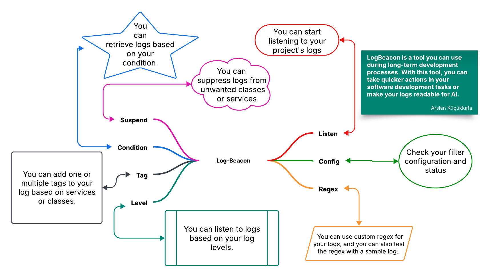

# Log Beacon

Log Beacon, log yönetimi için geliştirilmiş güçlü bir CLI uygulamasıdır. Sistemdeki logları gerçek zamanlı izleme, filtreleme, analiz etme ve yönetme imkanı sunar.

## 🚀 Özellikler

### 📡 Log Dinleme ve İzleme
- **Daemon Modu**: Arka planda sürekli çalışabilme
  - Otomatik yeniden başlatma
  - Durum kontrolü
  - Güvenli durdurma
- **Socket Desteği**: Logları TCP/UDP üzerinden iletebilme
  - WebSocket güvenliği (private/public key)
  - Asenkron iletişim
  - Çoklu client desteği
- **Gerçek Zamanlı İzleme**: Canlı log akışı görüntüleme

### 🔍 Log Analizi ve Filtreleme
- **Regex Desteği**: Özel regex pattern'leri ile log parsing
- **Log Seviyeleri**: DEBUG, INFO, WARN, ERROR gibi log seviyelerini filtreleme
- **Özelleştirilebilir Filtreler**:
    - Sınıf bazlı filtreleme
    - Servis bazlı filtreleme
    - Mesaj içeriği bazlı filtreleme

### 🏷 Etiketleme Sistemi
- Log kayıtlarını etiketleme
- Etiketlere göre filtreleme
- Etiket yönetimi (ekleme, silme, listeleme)

### ⚙️ Konfigürasyon Yönetimi
- Yapılandırma ayarlarını kaydetme ve yükleme
- Dinamik konfigürasyon güncelleme

## 📋 Kullanım

### Daemon Modu Komutları



```shell
# Daemon Modunda Başlatma
log-beacon listen run --port 8080 --daemon --args "java -jar app.jar"

# Daemon Durumu Kontrol
log-beacon listen check

# Daemon Durdurma
log-beacon listen stop

# Daemon Log Dosyalarını Görüntüleme
tail -f ~/.config/log-beacon/logs/daemon.out
```

### Temel Komutlar

```shell
# Normal Modda Başlatma
log-beacon listen run --port 8080 --args "java -jar app.jar"

# Log Seviyesi Ekleme
log-beacon level add INFO

# Regex Pattern Ekleme
log-beacon regex add --pattern "<pattern>"

# Etiket Ekleme
log-beacon tag add --object-type CLASS --object-name "MyClass" --tag "critical"
```

### Log Filtreleme

```shell
# Servis Bazlı Filtreleme
log-beacon condition add --object-type SERVICE --object-name "UserService"

# Geçici Olarak Belirli Logları Durdurma
log-beacon suspend add --object-type CLASS --object-name "DebugClass"
```

## 🛠 Teknik Detaylar

### Daemon Yönetimi
- PID dosyası yönetimi (`/tmp/log-beacon.pid`)
- Graceful shutdown desteği
- Log rotasyonu
- Otomatik yeniden başlatma

### WebSocket Güvenliği
- Private/Public key authentication
- SSL/TLS desteği
- Token bazlı yetkilendirme
- Rate limiting

### Log Parsing
- Özelleştirilebilir regex pattern'leri
- Çoklu log formatı desteği
- Yapılandırılabilir parsing kuralları

### Cross-Platform Destek
- Linux, macOS ve Windows desteği
- Platform özel optimizasyonlar
- Native process yönetimi

## 🔧 Kurulum

### Gereksinimler
- Rust 1.70 veya üzeri
- OpenSSL 1.1.1 veya üzeri
- Sistem izinleri:
  - Log dosyaları için yazma izni
  - PID dosyası oluşturma izni
  - Port bağlama izni (>1024 için root gerekli değil)

```shell
cargo install log-beacon
```

## 📝 Konfigürasyon

Varsayılan konfigürasyon dosyası `.config/log-beacon/config.toml`:

```toml
[socket]
port = "8080"
auth_enabled = true
key_path = "~/.config/log-beacon/keys/"

[daemon]
enabled = true
log_dir = "~/.config/log-beacon/logs/"
pid_file = "/tmp/log-beacon.pid"

[log]
levels = ["INFO", "ERROR", "WARN", "DEBUG", "TRACE"]
enabled = true

[regexp]
pattern = "(?P<time>\\d{4}-\\d{2}-\\d{2}T\\d{2}:\\d{2}:\\d{2}\\.\\d{3}[+-]\\d{2}:\\d{2})\\s+(?P<level>\\w+)\\s+(?P<pid>\\d+)\\s+---\\s+\\[(?P<service>[^\\]]+)\\]\\s+\\[(?P<thread>[^\\]]+)\\]\\s+(?P<class>[^:]+)\\s*:\\s*(?P<message>.*)"
```

## 🔍 Hata Ayıklama

### Log Dosyaları
- Daemon logları: `~/.config/log-beacon/logs/`
- Application logları: `~/.config/log-beacon/logs/app.log`
- Error logları: `~/.config/log-beacon/logs/error.log`

### Yaygın Hatalar
1. Port bağlama hatası
   - Çözüm: Port numarasını değiştirin veya mevcut kullanımı kontrol edin
2. Daemon başlatma hatası
   - Çözüm: PID dosyası ve log dizini izinlerini kontrol edin
3. WebSocket bağlantı hatası
   - Çözüm: Key dosyalarının varlığını ve izinlerini kontrol edin

## 🤝 Katkıda Bulunma

1. Fork edin
2. Feature branch oluşturun
3. Değişikliklerinizi commit edin
4. Branch'inizi push edin
5. Pull Request oluşturun

## 📄 Lisans

Bu proje MIT lisansı altında lisanslanmıştır.